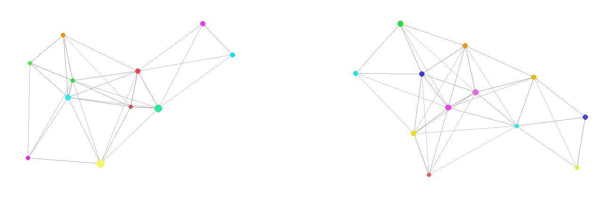

<div align="center">

<!-- Dark Mode Banner -->
<picture>
 <!-- بعد -->
<source media="(prefers-color-scheme: dark)"  srcset="profile_ziad_light.gif">
<source media="(prefers-color-scheme: light)" srcset="profile_ziad.gif">

</picture>

<br/>

[](https://git.io/typing-svg)

<br/>

[](https://github.com/ziad-zizo77)
[](https://github.com/ziad-zizo77)

</div>

---

## 🧑‍💻 About Me

```javascript
const ziad = {
  name: "Ziad Mohamed",
  role: "Front-End Developer",
  location: "Egypt 🇪🇬",
  skills: [
    "HTML5",
    "CSS3",
    "JavaScript",
    "TypeScript",
    "Sass",
    "SVG",
    "Canvas"
  ],
  tools: ["Git", "GitHub", "Node.js"],
  currentlyLearning: ["React.js"],
  funFact: "I enjoy turning ideas into interactive web experiences 🚀",
  openToWork: true,
};
```

---


### 🎨 Frontend

<p>
  
  
  
  
  
  
  
  
</p>

### 🛠️ Tools & DevOps

<p>
  
  
  
  
</p>
---

## 🎨 Featured Front-End Projects

<div align="center">


</div>

<br/>

<div align="center">


</div>
---
## 📈 Contribution Graph

<div align="center">

[](https://github.com/ashutosh00710/github-readme-activity-graph)

</div>

---

## 🌐 Connect With Me

<div align="center">

<a href="https://www.linkedin.com/in/ziad-mohamed-abb54838b">
  
</a>
<a href="https://github.com/ziad-zizo77">
  
</a>
<a href="https://mail.google.com/mail/?view=cm&to=zm4025828@gmail.com">
  
</a>

</div>

---

<div align="center">

### 💡 Random Dev Quote

[](https://github.com/piyushsuthar/github-readme-quotes)

<br/>

⭐️ **If you like my work, consider giving my repos a star!** ⭐️

<br/>

<picture>
  <source media="(prefers-color-scheme: dark)" srcset="profile_ziad.gif">
  <source media="(prefers-color-scheme: light)" srcset="profile_ziad_light.gif">
  
</picture>

</div>
